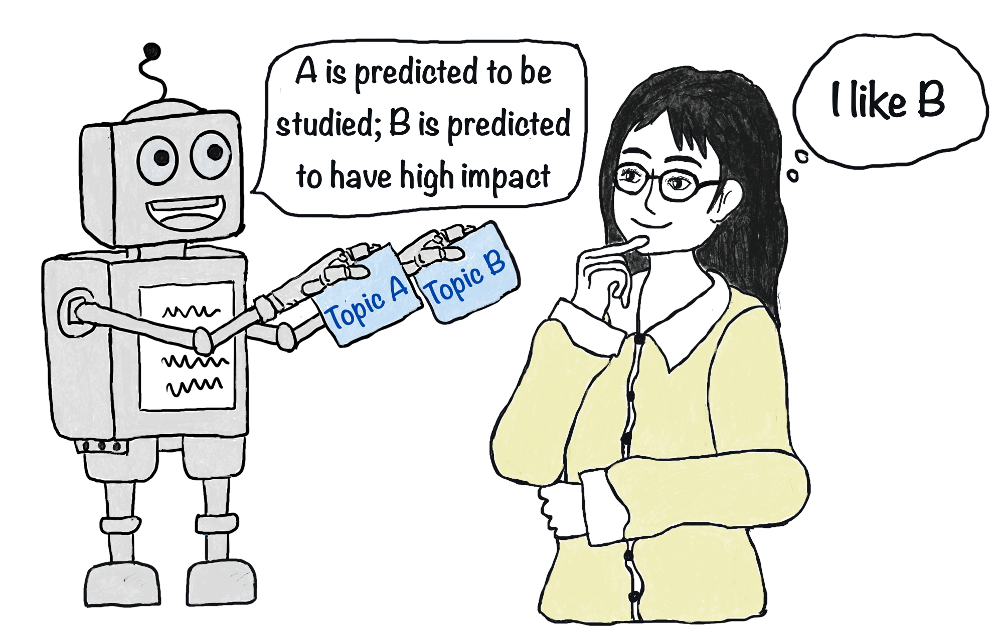

# Impact4Cast: Forecasting High-Impact Research Topics

## Forecasting high-impact research topics via machine learning on evolving knowledge graphs
 [**Xuemei Gu**](mailto:xuemei.gu@mpl.mpg.de), [**Mario Krenn**](mailto:mario.krenn@mpl.mpg.de)

### Which scientific concepts, that have never been investigated jointly, will lead to the most impactful research?

Here we show how to predict the impact of onsets of ideas that have never been published by researchers. For that, we developed a large evolving knowledge graph built from more than 21 million scientific papers. It combines a semantic network created from the content of the papers and an impact network created from the historic citations of papers. Using machine learning, we can predict the dynamic of the evolving network into the future with high accuracy, and thereby the impact of new research directions. We envision that the ability to predict the impact of new ideas will be a crucial component of future artificial muses that can inspire new impactful and interesting scientific ideas.

## <a name="ff">Prepare an evolving, citation-augmented knowledge graph</a>

### <a name="ff">1. Creating a list of scientific concepts</a>
**create_concept**: [/create_concept/](/create_concept/)
- **Concept_Corpus**:
  - `s0_get_preprint_metadata.ipynb`
  - `s1_make_metadate_arxivstyle.ipynb`
  - `s2_combine_all_preprint_metadate.ipynb`
  - `s3_get_concepts.ipynb`
  - `s4_improve_concept.ipynb`
    
- **Domain_Concept**:
  - `s0_prepare_optics_quantum_data.ipynb`
  - `s1_split_domain_papers.py`
  - `s2_get_domain_concepts.py`
  - `s3_merge_concepts.py`
  - `s4_improve_concepts.ipynb`
  - `s5_improve_manually_concepts.py`
  - full_domain_concepts.txt
 
### <a name="ff">2. Creating dynamic knowlegde graph</a>
**create_dynamic_edges**: [/create_dynamic_edges/](/create_dynamic_edges/)
- `_get_openalex_workdata.py`
- `get_concept_pairs.py`
- `merge_concept_pairs.py`
- `process_edge_to_pandas_frame.py`

 
## <a name="ff"> Utils Files and Prepare other data</a>
`prepare_adjacency_pagerank`

`prepare_unconnected_pair_solution.ipynb`

`general_utils.py`
  
`features_utils.py`

`preprocess_utils.py`
  
**get_dynamic_concepts**: [/get_dynamic_concepts/](/get_dynamic_concepts/)
- `get_concept_citation.py`
- `merge_concept_citation.py`
- `process_concept_to_pandas_frame.py`
  
**prepare_eval_data**: [/prepare_eval_data/](/prepare_eval_data/)
  - `prepare_eval_feature_data.py`
  - `prepare_eval_feature_data_condition.py`

## <a name="ff">Forecasting with Neural Network </a>

- `train_model_utils.py`
- `train_model_2019_run.py`
- `train_model_2019_condition.py`
- `train_model_2022_run.py`

## <a name="ff">Search Cliques </a>
**search_cliques**: [/search_cliques/](/search_cliques/)
 - `get_max_feature_for_norm_run.py`
 - `nn_prediation_cliques_run.py`
 - `search_cliques.py`
 - result_clique_T0_IR_010.txt
 
    

