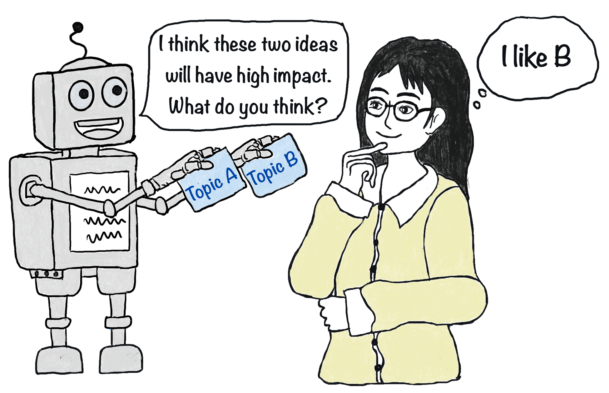
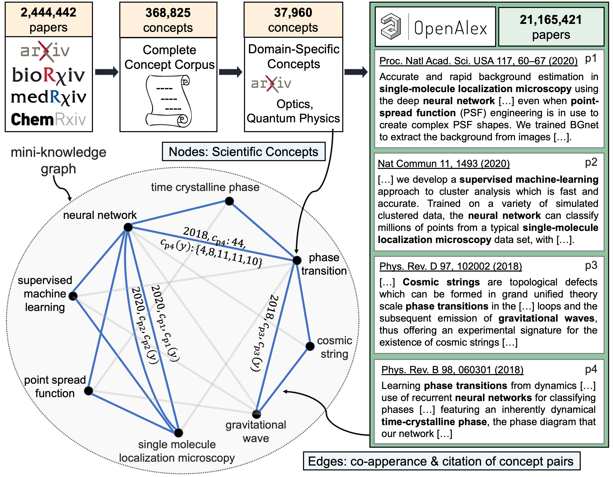
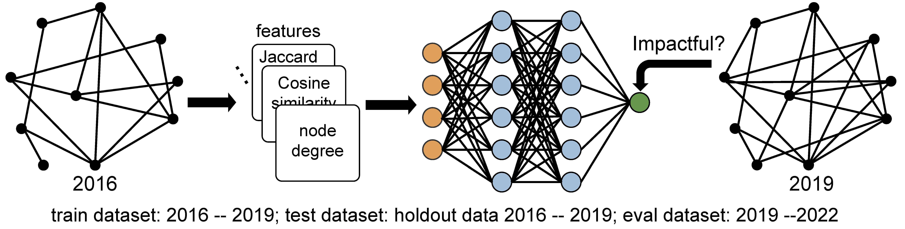

# Forecasting high-impact research topics via machine learning on evolving knowledge graphs

**Authors:** [**Xuemei Gu**](mailto:xuemei.gu@mpl.mpg.de), [**Mario Krenn**](https://mpl.mpg.de/research-at-mpl/independent-research-groups/krenn-research-group/)
\
**Preprint:** [arXiv:2402.08640](https://arxiv.org/abs/2402.08640)

**Which scientific concepts, that have never been investigated jointly, will lead to the most impactful research?**

> [!NOTE]\
> Full Dynamic Knowledge Graph and Datasets can be downloaded via [zenodo.org](https://zenodo.org/records/10692137)  

## <a name="ff">Prepare an evolving, citation-augmented knowledge graph</a>
### <a name="ff">Creating a list of scientific concepts</a>

<pre>
<a href="https://github.com/artificial-scientist-lab/Impact4Cast/tree/main/create_concepts">create_concept</a>
│ 
├── <a href="https://github.com/artificial-scientist-lab/Impact4Cast/tree/main/create_concepts/Concept_Corpus">Concept_Corpus</a>
│   ├── s0_get_preprint_metadata.ipynb: Get metadata from chemRxiv, medRxiv, bioRxiv (<a href="https://www.kaggle.com/datasets/Cornell-University/arxiv">arXiv data from Kaggle</a>)
│   ├── s1_make_metadate_arxivstyle.ipynb: Preprocessing metadata from different sources
│   ├── s2_combine_all_preprint_metadate.ipynb: Combining metadata
│   ├── s3_get_concepts.ipynb: Use NLP techniques (for instance <a href="https://github.com/csurfer/rake-nltk">RAKE</a>) to extract concepts
│   └── s4_improve_concept.ipynb: Further improvements of full concept list
│   
└── <a href="https://github.com/artificial-scientist-lab/Impact4Cast/tree/main/create_concepts/Domain_Concept">Domain_Concept</a>
    ├── s0_prepare_optics_quantum_data.ipynb: Get papers for specific domain (optics and quantum physics in our case).
    ├── s1_split_domain_papers.py: Prepare data for parallelization.
    ├── s2_get_domain_concepts.py: Get domain-specific vertices in full concept list.
    ├── s3_merge_concepts.py: Postprocessing domain-specific concepts
    ├── s4_improve_concepts.ipynb: Further improve concept lists
    ├── s5_improve_manually_concepts.py: Manually inspect the concepts in the very end for grammar, non-conceptual phrases, verbs, ordinal numbers, conjunctions, adverbials and so on, to improve quality
    └── full_domain_concepts.txt: Final list of 37,960 concepts (represent vertices of knowledge graph)
</pre>
 
### <a name="ff">Creating dynamic knowlegde graph</a>

<pre>
<a href="https://github.com/artificial-scientist-lab/Impact4Cast/tree/main/create_dynamic_edges">create_dynamic_edges</a>
├── _get_openalex_workdata.py: Get metadata from <a href="https://openalex.org/">OpenAlex</a>)
├── _get_openalex_workdata_parallel_run1.py: Get parts of the metadata from OpenAlex (run in many parts)
├── get_concept_pairs.py: Create edges of the knowledge graph (edges carry the time and citation information).
├── merge_concept_pairs.py: Combining edges files
└── process_edge_to_pandas_frame.py: Post-processing, store the full dynamic knowledge graph
</pre>

### <a name="ff">Prepare other data</a>
<pre>
.
├── prepare_unconnected_pair_solution.ipynb: Find unconnected concept pairs (for training, testing and evaluating)
├── prepare_adjacency_pagerank.py: Prepare dynamic knowledge graph and compute properties
│
├──<a href="https://github.com/artificial-scientist-lab/Impact4Cast/tree/main/create_dynamic_concepts">create_dynamic_concepts</a>
│  ├── get_concept_citation.py: Create dynamic concepts from the knowledge graph (concepts carry the time and citation information). 
│  ├── merge_concept_citation.py: Combining dynamic concepts files
│  └── process_concept_to_pandas_frame.py: Post-processing, store the full dynamic concepts
│  ├── merge_concept_pairs.py: Combining dynamic concepts
│  └── process_edge_to_pandas_frame.py: Post-processing, store the full dynamic concepts
│
└──<a href="https://github.com/artificial-scientist-lab/Impact4Cast/tree/main/prepare_eval_data">prepare_eval_data</a>
   ├── prepare_eval_feature_data.py: Prepare features of knowledge graph (for evaluation dataset)
   └── prepare_eval_feature_data_condition.py: Prepare features of knowledge graph (for evaluation dataset, conditioned on existence in the future)
</pre>

## <a name="ff">🤖Forecasting with Neural Network </a>

<pre>
.
├── train_model_2019_run.py: Training neural network from 2016 -> 2019 (evaluated form 2019 -> 2022).
├── train_model_2019_condition.py: Training neural network from 2016 -> 2019 (evaluated form 2019 -> 2022, conditioned on existence in the future)
├── train_model_2019_individual_feature.py: Training neural network from 2016 -> 2019 (evaluated form 2019 -> 2022) on individual features
└── train_model_2022_run.py: Training 2019 -> 2022 (for real future predictions of 2025)
</pre>
 

  
<b>Feature descriptions for an unconnected pair of concepts (u, v)</b>

<table>
    <tr>
        <th>Feature Type</th>
        <th>Feature Index</th>
        <th>Feature Description</th>
    </tr>
    <tr>
        <td rowspan="6" style="border-bottom: none;">node feature</td>
        <td>0-5</td>
        <td>the number of neighbours for vertices $u$ and $v$ in years $y$, $y-1$, $y-2$  denoted as: $N_{u,y}$, $N_{v,y}$, $N_{u,y-1}$, $N_{v,y-1}$, $N_{u, y-2}$, $N_{v, y-2}$ </td>
    </tr>
    <!-- Rows 2 to 10 for the first 'node feature' -->
    <tr><td>6-7</td><td>the number of new neighbors since 1 years prior to $y$ for vertices $u$ and $v$ denoted as: $N_{u,y}^{\Delta}$, $N_{v,y}^{\Delta}$
</td></tr>
    <tr><td>8-9</td><td>the number of new neighbors since 2 years prior to $y$ for vertices $u$ and $v$  denoted as: $N_{u,y}^{\Delta 2}$, $N_{v,y}^{\Delta 2}$</td></tr>
    <tr><td>10-11</td><td>the rank of the number of new neighbors since 1 years prior to $y$ for vertices $u$ and $v$  denoted as: $rN_{u,y}^{\Delta}$, $rN_{v,y}^{\Delta}$</td></tr>
    <tr><td>12-13</td><td>the rank of the number of new neighbors since 2 years prior to $y$ for vertices $u$ and $v$  denoted as: $rN_{u,y}^{\Delta 2}$, $rN_{v,y}^{\Delta 2}$</td></tr>
    <tr><td>14-19</td><td>the PageRank score for vertices $u$ and $v$ in years $y$, $y-1$, $y-2$ denoted as: $PR_{u,y}$, $PR_{v,y}$, $PR_{u,y-1}$, $PR_{v,y-1}$, $PR_{u, y-2}$, $PR_{v, y-2}$ </td></tr>
    <!-- Starting the next 10 rows for the second 'node feature' -->
    <tr>
        <td rowspan="15" style="border-bottom: none;">node citation feature</td>
        <td>20-25</td>
        <td>yearly citation for vertices $u$ and $v$ during the years $y$, $y-1$, $y-2$ denoted as: $c_{u,y}$ , $c_{v,y}$, $c_{u,y-1}$, $c_{v,y-1}$, $c_{u,y-2}$, $c_{v,y-2}$</td>
    </tr>
    <tr><td>26-31</td><td>total citation for vertices $u$ and $v$ since their first publications to the year $y$, $y-1$, $y-2$ denoted as: $ct_{u,y}$ , $ct_{v,y}$, $ct_{u,y-1}$, $ct_{v,y-1}$, $ct_{u,y-2}$, $ct_{v,y-2}$ </td></tr>
    <tr><td>32-37</td><td>total citation for vertices $u$ and $v$ in three-year period ending with the year $y$, $y-1$, $y-2$ denoted as: $ct^{\Delta 3}_{u,y}$ , $ct^{\Delta 3}_{v,y}$, $ct^{\Delta 3}_{u,y-1}$, $ct^{\Delta 3}_{v,y-1}$, $ct^{\Delta 3}_{u,y-2}$, $ct^{\Delta 3}_{v,y-2}$</td></tr>
    <tr><td>38-43</td><td>the number of papers mentioning either concept ($u$ or $v$) until the year $y$, $y-1$, $y-2$ denoted as: $pn_{u,y}$ , $pn_{v,y}$, $pn_{u,y-1}$, $pn_{v,y-1}$, $pn_{u,y-2}$, $pn_{v,y-2}$</td></tr>
    <tr><td>44-49</td><td>The average yearly citation for vertices $u$ and $v$ during the years $y$, $y-1$, and $y-2$  calculated based on the total citations received during the year divided by the number of papers mentioning the vertices from their first publications up to the respective year denoted as: $cm_{u,y}$ , $cm_{v,y}$, $cm_{u,y-1}$, $cm_{v,y-1}$, $cm_{u,y-2}$, $cm_{v,y-2}$; as an example: $cm_{u,y}$ is $\frac{c_{u,y}}{pn_{u,y}}$</td></tr>
    <tr><td>50-55</td><td>The average total citation for vertices $u$ and $v$ since their first publications to the year $y$, $y-1$, $y-2$ determined by dividing the cumulative citations by the count of papers that mentioned these vertices since their first publications denoted as: $ctm_{u,y}$ , $ctm_{v,y}$, $ctm_{u,y-1}$, $ctm_{v,y-1}$, $ctm_{u,y-2}$, $ctm_{v,y-2}$; as an example: $ctm_{u,y}$ is $\frac{ct_{u,y}}{pn_{u,y}}$</td></tr>
    <tr><td>56-61</td><td>The average total citation for vertices $u$ and $v$ in three-year period ending with the year $y$, $y-1$, $y-2$  calculated by dividing the cumulative three-year period citations by the count of papers that mentioned these vertices since their first publications denoted as: $ctm^{\Delta 3}_{u,y}$ , $ctm^{\Delta 3}_{v,y}$, $ctm^{\Delta 3}_{u,y-1}$, $ctm^{\Delta 3}_{v,y-1}$, $ctm^{\Delta 3}_{u,y-2}$, $ctm^{\Delta 3}_{v,y-2}$; as an example: $ctm^{\Delta 3}_{u,y}$ is $\frac{ct^{\Delta 3}_{u,y}}{pn_{u,y}}$</td></tr>
    <tr><td>62-63</td><td>the number of new citations for vertices $u$ and $v$, since 1 years prior to y  denoted as: $cnew^{\Delta 1}_{u,y}$ , $cnew^{\Delta 1}_{v,y}$ </td></tr>
    <tr><td>64-65</td><td>the number of new citations for vertices $u$ and $v$, since 2 years prior to y  denoted as: $cnew^{\Delta 2}_{u,y}$ , $cnew^{\Delta 2}_{v,y}$ </td></tr>
    <tr><td>66-67</td><td>the rank of the number of new citations for vertices $u$ and $v$, since 1 year prior to y  denoted as: $rcnew^{\Delta 1}_{u,y}$ , $rcnew^{\Delta 1}_{v,y}$ </td></tr>
    <tr><td>68-69</td><td>the rank of the number of new citations for vertices $u$ and $v$, since 2 years prior to y  denoted as: $rcnew^{\Delta 2}_{u,y}$ , $rcnew^{\Delta 2}_{v,y}$ </td></tr>
    <tr><td>70-71</td><td>the number of new papers mentioning vertices $u$ and $v$, since 1 year prior to y denoted as: $pnew^{\Delta 1}_{u,y}$ , $pnew^{\Delta 1}_{v,y}$ </td></tr>
    <tr><td>72-73</td><td>the number of new papers mentioning vertices $u$ and $v$, since 2 years prior to y denoted as: $pnew^{\Delta 2}_{u,y}$ , $pnew^{\Delta 2}_{v,y}$ </td></tr>
    <tr><td>74-75</td><td>the rank of the number of new papers mentioning vertices $u$ and $v$, since 1 year prior to y denoted as: $rpnew^{\Delta 1}_{u,y}$ , $rpnew^{\Delta 1}_{v,y}$ </td></tr>
    <tr><td>76-77</td><td>the rank of the number of new papers mentioning vertices $u$ and $v$, since 2 years prior to y denoted as: $rpnew^{\Delta 2}_{u,y}$, $rpnew^{\Delta 2}_{v,y}$ </td></tr>
    <!-- Starting the next 10 rows for the second 'node feature' -->
    <tr>
        <td rowspan="7" style="border-bottom: none;">pair feature</td>
        <td>78-80</td>
        <td>the number of shared neighbors between vertices $u$ and $v$ for the years $y$, $y-1$, $y-2$   denoted as: $ns_{y}$, $ns_{y-1}$, $ns_{y-2}$</td>
    </tr>
    <tr><td>81-83</td><td>the geometric coefficient for the pair ($u$ and $v$) for the years $y$, $y-1$, $y-2$ calculated by number_shared_neighbor**2 / (deg_u * deg_v), deg_u is the degree of vertex $u$   denoted as: $geo_{y}$, $geo_{y-1}$, $geo_{y-2}$</td></tr>
    <tr><td>84-86</td><td>the cosine coefficient for the pair ($u$ and $v$) for the years $y$, $y-1$, $y-2$ calculated by geometric_index**0.5  denoted as: $cos_{y}$, $cos_{y-1}$, $cos_{y-2}$</td></tr>
    <tr><td>87-89</td><td>the simpson coefficient for the pair ($u$ and $v$) for the years $y$, $y-1$, $y-2$ calculated by number_shared_neighbor / np.min([deg_u, deg_u])  denoted as: $spi_{y}$, $spi_{y-1}$, $spi_{y-2}$</td></tr>
    <tr><td>90-92</td><td>the preferential attachment coefficient for the pair ($u$ and $v$) for the years $y$, $y-1$, $y-2$ calculated by deg_u*deg_u  denoted as: $pre_{y}$, $pre_{y-1}$, $pre_{y-2}$</td></tr>
    <tr><td>93-95</td><td>the Sørensen–Dice coefficient for the pair ($u$ and $v$) for the years $y$, $y-1$, $y-2$ calculated by 2*num_shared_neighbor / (deg_u + deg_v)  denoted as: $sod_{y}$, $sod_{y-1}$, $sod_{y-2}$</td></tr>
    <tr><td>96-98</td><td>the jaccard coefficient for the pair ($u$ and $v$) for the years $y$, $y-1$, $y-2$ calculated by num_shared_neighbor/(deg_u + deg_v - num_shared_neighbor)  denoted as: $jac_{y}$, $jac_{y-1}$, $jac_{y-2}$ </td></tr>
     <!-- Starting the next 10 rows for the second 'node feature' -->
    <tr>
        <td rowspan="14" style="border-bottom: none;">pair citation feature</td>
        <td>99-101</td>
        <td>the ratio of the sum of citations received by concepts $u$ and $v$ in the year $y$ to the sum of number of papers mentioning either concept, similar for years $y-1$, $y-2$ calculated by ($c_{u,y}$ + $c_{v,y}$) / ($pn_{u,y}$ + $pn_{v,y}$) </td>
    </tr>
    <tr><td>102-104</td><td>the ratio of the product of citations received by concepts $u$ and $v$ in the year $y$ to the sum of number of papers mentioning either concept, similar for years $y-1$, $y-2$ calculated by ($c_{u,y}$ * $c_{v,y}$) / ($pn_{u,y}$ + $pn_{v,y}$) </td></tr>
    <tr><td>105-107</td><td>the sum of the average citations received by concepts $u$ and $v$ in the year $y$, $y-1$, $y-2$ e.g., calculated by ($cm_{u,y}$ + $cm_{v,y}$) for year y</td></tr>
    <tr><td>108-110</td><td>the sum of the average total citations received by concepts $u$ and $v$ from their first publication up to the year $y$, $y-1$, $y-2$  e.g., calculated by ($ctm_{u,y}$ , $ctm_{v,y}$) for year y </td></tr>
    <tr><td>111-113</td><td>the sum of the citations received by concepts $u$ and $v$ in the three-year period ending with year $y$, $y-1$, $y-2$, e.g., calculated by ($ct^{\Delta 3}_{u,y}$ + $ct^{\Delta 3}_{v,y}$) for year y</td></tr>
    <tr><td>114-116</td><td>the sum of the average citations received by concepts $u$ and $v$ in the three-year period ending with year $y$, $y-1$, $y-2$, e.g., calculated by ($ctm^{\Delta 3}_{u,y}$ + $ctm^{\Delta 3}_{v,y}$) for year y</td></tr>
    <tr><td>117-119</td><td>the minimum number of the citations received by either concept $u$ or $v$ in the year $y$, $y-1$, $y-2$, e.g., min($c_{u,y}$, $c_{u,y}$)</td></tr>
    <tr><td>120-122</td><td>the maximum number of the citations received by either concept $u$ or $v$ in the year $y$, $y-1$, $y-2$, e.g., max($c_{u,y}$, $c_{u,y}$)</td></tr>
    <tr><td>123-125</td><td>the minimum number of the total citations received by either concept $u$ or $v$ since its frist publication to the year $y$, $y-1$, $y-2$, e.g., min($ct_{u,y}$, $ct_{u,y}$) </td></tr>
    <tr><td>126-128</td><td>the maximum number of the total citations received by either concept $u$ or $v$ since its frist publication to the year $y$, $y-1$, $y-2$, e.g., max($ct_{u,y}$, $ct_{u,y}$)</td></tr>
    <tr><td>129-131</td><td>the minimum number of total citations received by either concept $u$ or $v$ in the three-year period ending with year $y$, $y-1$, $y-2$, e.g., min($ct^{\Delta 3}_{u,y}$ , $ct^{\Delta 3}_{v,y}$)</td></tr>
    <tr><td>132-134</td><td>the maximum number of total citations received by either concept $u$ or $v$ in the three-year period ending with year $y$, $y-1$, $y-2$, e.g., max($ct^{\Delta 3}_{u,y}$ , $ct^{\Delta 3}_{v,y}$)</td></tr>
    <tr><td>135-137</td><td>the minimum number of papers mentioning either concept $u$ or $v$, for year $y$, $y-1$, $y-2$; e.g., min($pn_{u,y}$ , $pn_{v,y}$), min($pn_{u,y-1}$ , $pn_{v,y-1}$), min($pn_{u,y-2}$ , $pn_{v,y-2}$)</td></tr> 
    <tr><td>138-140</td><td>the maximum number of papers mentioning either concept $u$ or $v$, for year $y$, $y-1$, $y-2$; e.g., max($pn_{u,y}$ , $pn_{v,y}$), max($pn_{u,y-1}$ , $pn_{v,y-1}$), max($pn_{u,y-2}$ , $pn_{v,y-2}$)</td></tr>  
</table>

 
